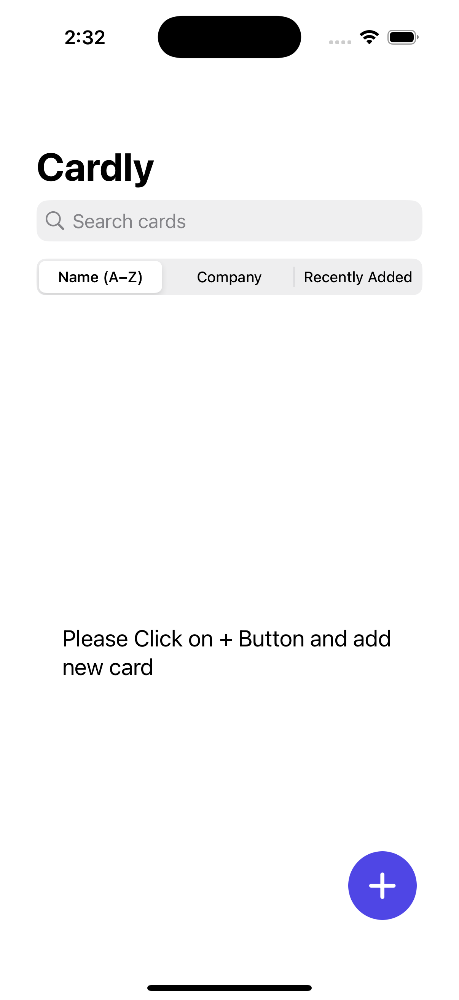
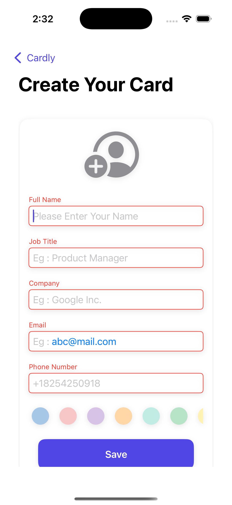
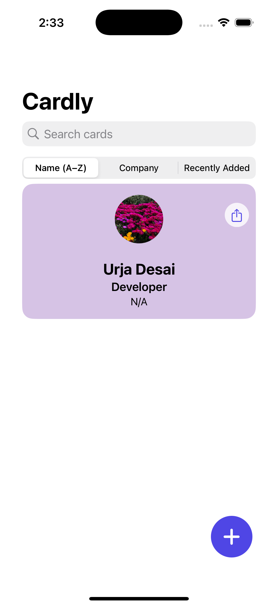

# 📇 Cardly – Digital Business Card App

Cardly is a beautifully designed iOS app that lets users create, manage, and share customizable digital business cards. Built with SwiftUI using MVVM architecture, Cardly supports multiple card profiles, QR code sharing, vCard export, and system-wide dark mode.

---

## ✨ Features

- 📝 Create personalized business cards with name, title, company, contact info, and color
- 👥 Manage multiple card profiles (e.g. Work, Freelance, Personal)
- 📱 Share your card via QR code or export as a vCard (.vcf)
- 🔍 Search and sort cards by name, company, or recently added
- 💾 Core Data for offline persistence
- 🎨 Custom color themes with `ColorThemeManager`
- 🌙 Full **dark mode** support out of the box
- 🚀 Smooth onboarding for first-time users

---

## 🛠 Tech Stack

- **Language:** Swift
- **Framework:** SwiftUI
- **Architecture:** MVVM
- **Persistence:** Core Data
- **Utilities:** QRCode Generator, vCard Exporter

---

## 📸 Screenshots

### 🟦 Splash Screen


### 🧭 Card List


### 📝 Create Card


### 🧾 Card Preview


### 📤 QR Code Sharing


---

## 💡 Possible Future Enhancements

- 🧾 **Business card templates** – Let users pick from pre-designed layout styles (minimalist, professional, creative)
- 🔄 iCloud sync for backup across devices
- 🗂 Export/import full card sets
- 🌍 Localization for other languages

---

## 📦 Getting Started

1. Clone the repo:
   ```bash
   git clone https://github.com/urja1112/Cardly.git
2. cd Cardly
   open Cardly.xcodeproj
3. Select an iPhone simulator (e.g. iPhone 16 Pro)
   Press Cmd + R or click ▶️ in Xcode

🛠 Requires Xcode 15+ and deployment target of iOS 16+
